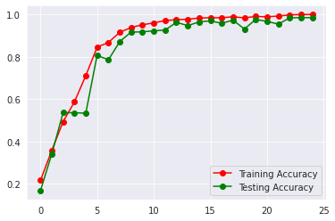
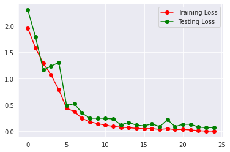
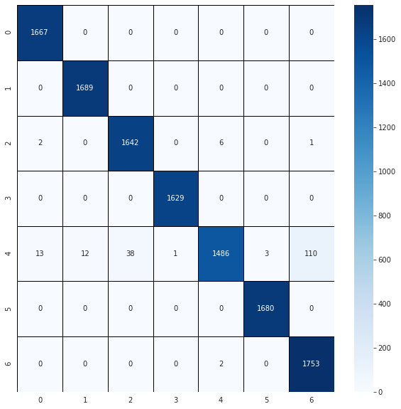

# Machine Learning Notebook for B21-CAP0383

## :book: Description

Cancer impacted about nearly <b>10 million deaths in the world (WHO) by 2020</b>. One of the most common types of cancer
was skin (non-melanoma) with 1.2 million cases. Skin cancer was common but not everyone was aware of this cancer. Most
people not doing self-diagnoses, they might not understand how to do it periodically. Because of the late action, the
death rate of these cases is still on top of the chart. Through technology, self diagnosis can be provided in an easier
way. This may help to prevent skin cancer and reduce the death rate.

## :chart_with_upwards_trend: Training Analysis

training analysis shows below:

1. Training Accuracy
    The training shows that accuracy is getting higher and consistent by epoch 20 
   
1. <b>Training Loss</b>
    The training shows that loss is getting lower and consistent by epoch 20 
   

## :alembic: Confusion Matrix

 The Confusion Matrix shows that classification model did a good job. Then, there is one problem where classification
did not show satisfy result and that is NV or Melanocytic Nevi (indicated by number 4). 
